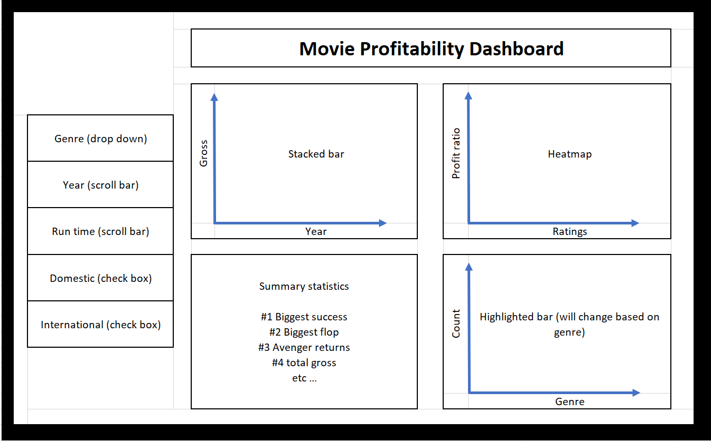

# DSCI532_group214_movies

**Movie Profitability Dashboard**

The design of the dashboard is inspired by the need to provide direction to the U.S. producer to make a movie. The dashboard has options on the left and plots on the right. Since the producer is new to the movie industry, there are a few basic options that the producer could toggle and navigate. The primary ones are genre which will be a drop-down menu with top 5 `genres` of all times and `year` which will be a double scroll bar. There are additional ones for `runtime` which will be a scroll bar, and check boxes for `domestic` and `international` performance of the movie. Away from the margin for the options, there are 4 sections for viewing the plots. The first one plots the gross output over the years as a simple bar chart providing how well the movie performed in the box office. The second one is a heatmap plotted between profit ratio and ratings. The main insight the producer would be able to derive is that based on the ratings, what was the profit ratio (gross output divided by budget of the movie) ? This is important since the producer would like to get a sense of their return on investment based on the ratings that their potential movie could achieve.  The third plot shows the number of movies for the 5 genres. Based on the filters applied on the left, plots would appropriately display. The final one provides summary statistics pertaining to the best and worst movies of all times. We hope the dashboard is successful in persuading the producer to choose a genre and potentially be successful with their choice!

[Main repo](https://github.com/UBC-MDS/DSCI532_group214_movies/tree/2bfb401e38ec127e67a44febf659175523466aec)
